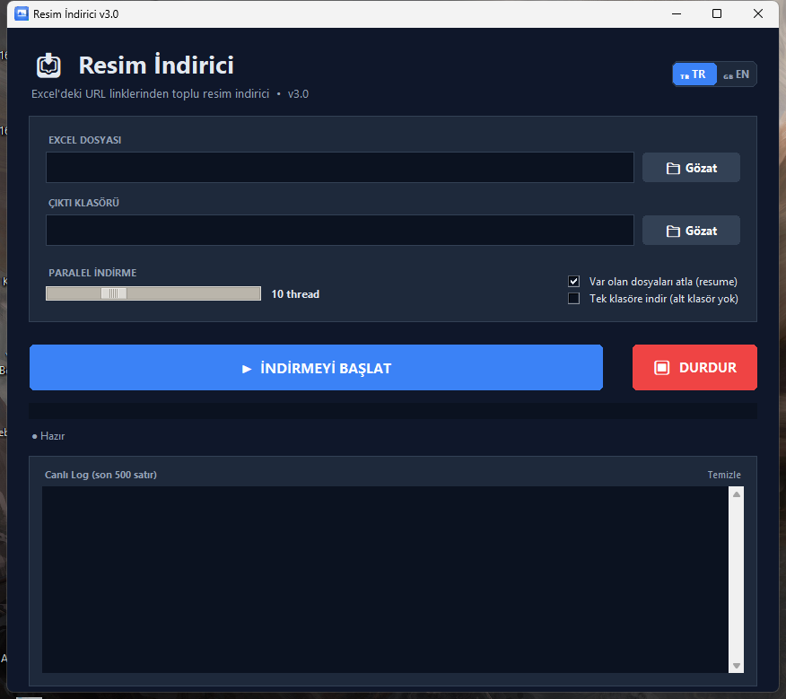
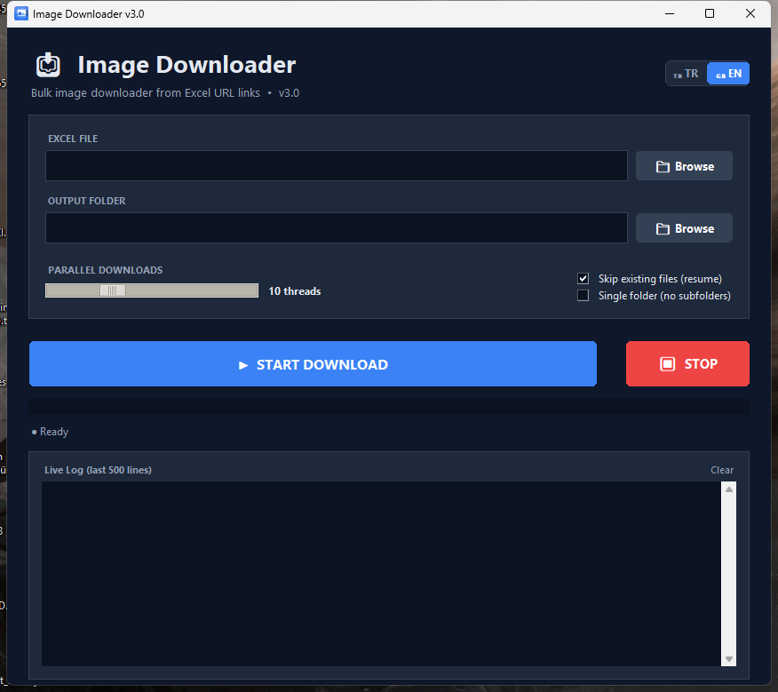

# 📥 Excel Image Downloader

**[🇹🇷 Türkçe](#-türkçe)** • **[🇬🇧 English](#-english)**


<p align="center">
  
  
</p>

---

## 🇹🇷 Türkçe

Excel dosyalarındaki URL linklerinden toplu resim indirme aracı. **TR / EN dil desteği**, modern koyu tema, paralel indirme, resume desteği ve drag-and-drop ile.

> Excel'in içinde URL olarak duran binlerce resim linkini otomatik indirip, istersen her ürün için ayrı klasöre, istersen tek klasöre toplar.

### ✨ Özellikler

- 🌐 **TR / EN dil desteği** — sağ üstten anlık değiştir (ayarın kaydedilir)
- 🌙 **Modern koyu tema** — rahat göz için
- ⚡ **Paralel indirme** — 1-32 thread slider ile ayarlanabilir
- ↷ **Resume (kaldığı yerden devam)** — var olan dosyaları atlar
- 📁 **İki mod:** her ürün ayrı klasöre **veya** hepsi tek klasöre
- 📎 **Drag & Drop** — Excel'i sürükle bırak, otomatik yüklenir
- ⏹ **Durdur butonu** — istediğin an temiz durur
- 📊 **Canlı hız + ETA** — "15.3/sn • kalan ~2sa 14dk"
- 📂 **Klasörü aç butonu** — indirme biter bitmez tek tıkla açılır
- 📝 **Hata raporu** — başarısız URL'ler `hatalar.txt`'ye yazılır
- 🔢 **3'lü canlı sayaç** — OK • ATLANAN • HATA
- 💾 **Ayar hatırlama** — son kullanılan dosya, klasör, thread sayısı korunur
- ℹ **About penceresi** — geliştirici iletişim linkleri
- 🧵 **Büyük Excel desteği** — 100.000+ satır, `read_only` modla RAM yemez

### 🚀 Hızlı Başlangıç

#### Seçenek 1: Hazır EXE (Windows)

1. [Releases](../../releases) sayfasından en son `ResimIndirici.exe`'yi indir
2. Çift tıkla, çalıştır
3. Python kurmaya gerek yok ✅

> ⚠️ Windows SmartScreen uyarısı çıkarsa: *"Daha fazla bilgi → Yine de çalıştır"*. İmzalı değil çünkü (false positive).

#### Seçenek 2: Kaynak koddan çalıştır

```bash
git clone https://github.com/ayberkbgln/excel-image-downloader.git
cd excel-image-downloader
pip install -r requirements.txt
python app.py
```

#### Seçenek 3: Kendi EXE'ni build et

```bash
pip install -r requirements.txt
python make_icon.py
pyinstaller --noconfirm --onefile --windowed ^
    --name "ResimIndirici" ^
    --icon=icon.ico ^
    --add-data "icon.ico;." ^
    --hidden-import tkinterdnd2 ^
    --collect-all tkinterdnd2 ^
    app.py
```

EXE → `dist/ResimIndirici.exe`

### 📋 Excel Formatı

| A sütunu | B, C, D, ... sütunları |
|---|---|
| Ürün kodu (klasör adı olacak) | Resim URL'leri |

**Örnek:**

| Malzeme Kodu | Foto 1 | Foto 2 | Foto 3 |
|---|---|---|---|
| 11680150005 | https://cdn.../11680150_1.jpg | https://cdn.../11680150_2.jpg | https://cdn.../11680150_3.jpg |
| 11657262006 | https://cdn.../11657262_1.jpg | https://cdn.../11657262_2.jpg | |

- İlk satır başlık olarak kabul edilir (atlanır)
- A sütunu = klasör adı
- 2. sütundan itibaren `http` ile başlayan her hücre indirilir
- Boş hücreler atlanır

### 🎛️ Kullanım

1. **Excel Dosyası:** `.xlsx` seç (veya sürükle-bırak)
2. **Çıktı Klasörü:** resimlerin ineceği yer
3. **Paralel İndirme:** 10 thread genelde ideal
4. **Opsiyonlar:**
   - ☑ **Var olan dosyaları atla** — resume desteği
   - ☐ **Tek klasöre indir** — hepsini tek yere toplar
5. **▶ İNDİRMEYİ BAŞLAT**
6. Bittiğinde **📂 Klasörü Aç** butonu belirir

### 📊 Performans

| Resim Sayısı | Thread | Tahmini Süre |
|---|---|---|
| 100 | 10 | ~15 sn |
| 1.000 | 10 | ~2-3 dk |
| 10.000 | 10 | ~20-30 dk |
| 100.000 | 15 | ~3-5 saat |

*Sunucu hızına ve internet bağlantısına göre değişir.*

### 🐛 Sık Karşılaşılan Sorunlar

<details>
<summary><b>"Windows SmartScreen bunu engelledi"</b></summary>
EXE dijital imzalı değil. "Daha fazla bilgi" → "Yine de çalıştır" de. Kod açık.
</details>

<details>
<summary><b>Antivirüs yanlış alarm veriyor</b></summary>
PyInstaller ile build edilen EXE'lerde false positive normaldir. İstisna ekleyebilirsin veya kaynak koddan kendin build et.
</details>

<details>
<summary><b>Tek klasör modunda resim sayısı az geliyor</b></summary>
Aynı isimli dosyalar birbirinin üzerine yazar. "Tek klasör" kapalı kalsın.
</details>

---

## 🇬🇧 English

Bulk image downloader that extracts URLs from Excel files. **TR / EN UI**, modern dark theme, parallel downloads, resume support, and drag-and-drop.

> Downloads thousands of image URLs from Excel cells — into per-product subfolders or a single folder.

### ✨ Features

- 🌐 **TR / EN language switch** — toggle from the top-right, settings persist
- 🌙 **Modern dark theme**
- ⚡ **Parallel downloads** — 1-32 threads via slider
- ↷ **Resume support** — skip already-downloaded files
- 📁 **Two modes:** per-product subfolders **or** single flat folder
- 📎 **Drag & Drop** — drop Excel file onto the app
- ⏹ **Stop button** — clean cancellation
- 📊 **Live speed + ETA**
- 📂 **Open folder button** — one click after completion
- 📝 **Error report** — failed URLs saved to `hatalar.txt`
- 🔢 **Triple live counter** — OK • SKIPPED • FAILED
- 💾 **Settings memory** — remembers last file, folder, thread count
- ℹ **About dialog** — developer contact links
- 🧵 **Large Excel support** — 100,000+ rows, low-RAM `read_only` mode

### 🚀 Quick Start

#### Option 1: Prebuilt EXE (Windows)

1. Download latest `ResimIndirici.exe` from [Releases](../../releases)
2. Double-click to run — no Python required ✅

> ⚠️ If SmartScreen warns you: *"More info → Run anyway"* (false positive).

#### Option 2: Run from source

```bash
git clone https://github.com/ayberkbgln/excel-image-downloader.git
cd excel-image-downloader
pip install -r requirements.txt
python app.py
```

### 📋 Excel Format

| Column A | Columns B+ |
|---|---|
| Product code (folder name) | Image URLs |

- First row treated as header
- Column A = folder name
- Any cell starting with `http` is downloaded

### 📊 Performance

| Image Count | Threads | Estimated Time |
|---|---|---|
| 100 | 10 | ~15 sec |
| 1,000 | 10 | ~2-3 min |
| 10,000 | 10 | ~20-30 min |
| 100,000 | 15 | ~3-5 hours |

---

## 🛠️ Tech Stack

- Python 3.8+ · Tkinter · openpyxl · concurrent.futures · PyInstaller · Pillow · tkinterdnd2

## 📄 License

MIT — see [LICENSE](LICENSE)

## 👤 Developer

**Ayberk Bağlan**

- 🐙 GitHub: [@ayberkbgln](https://github.com/ayberkbgln)
- 🐦 X / Twitter: [@yulewiz](https://x.com/yulewiz)
- 💼 LinkedIn: [in/ayberkbaglan](https://www.linkedin.com/in/ayberkbaglan/)
- ✉ Email: ayberkbaglan@gmail.com

> Contributions, issues, and PRs welcome. Leave a ⭐ if it helped!
